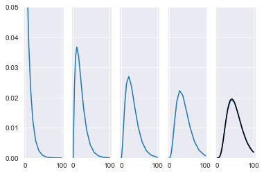

### Distributed Delay Equations and the Linear Chain Trick
##### Chapter 7 of Smith 2010

Figure out how the number of compartments and decay rate are related to the gamma distribution parameters.


```python
from scipy.integrate import solve_ivp
import matplotlib.pyplot as plt
from numpy import *
import scipy.stats as stats 
import seaborn as sns
sns.set_style("darkgrid")

def exponential_decay(t, y, a, blank):
    return -a*y

# a = 1 # initial condition and decay rate
tspan = [0,100]

# sol = solve_ivp(exponential_decay, tspan, [a], args = (a, 1)) 
# plt.plot(sol.t, sol.y[0], 'k--s');

def Two_stage(t, y, a, blank):
    return [-a*y[0],
             a*(y[0]-y[1])]

# a = 1
# sol = solve_ivp(Two_stage, tspan, [a,0], args = (a, 1)) 
# plt.plot(sol.t, sol.y[0], 'k--s');
# plt.plot(sol.t, sol.y[1], 'k--s');

def stage_maker(t, y, a, num_compartments):
    RHS = empty(num_compartments)
    RHS[0] = -a*y[0]
    for n in arange(1,num_compartments):
        RHS[n] = a*(y[n-1]-y[n])
    return RHS

a = 0.1
num_compartments = 5
y0 = zeros(num_compartments)
y0[0] = a
sol = solve_ivp(stage_maker, tspan, y0, args = (a, num_compartments), dense_output=True) 

fig, ax = plt.subplots(1, num_compartments, sharey = True)
plt.gca().set_ylim(0,.05);

for i in arange(num_compartments):
    ax[i].plot(sol.t, sol.y[i])

# plt.plot(sol.t, sum(sol.y.T, axis = 1));

x = linspace(tspan[0],tspan[1],100)
y1 = stats.gamma.pdf(x, a=5, scale=10)

ax[4].plot(x, y1, 'k');
```


    

    


```python

```
